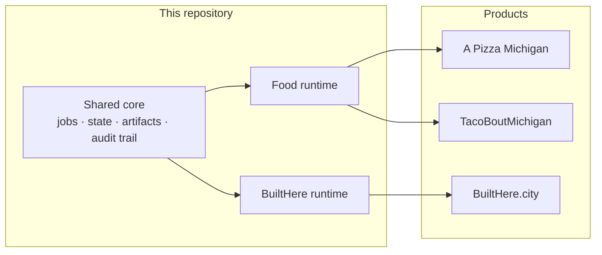
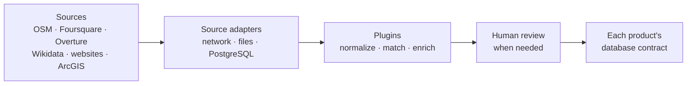

# Map Data Aggregation and Enhancement Pipeline

[](https://github.com/Antwohlf/map-data-aggregation-enhancement-pipeline/actions/workflows/ci.yml)

I moved the Pizza and Taco import jobs here after they outgrew the website repository. The same pipeline now supports [A Pizza Michigan](https://www.apizzamichigan.com), [TacoBoutMichigan](https://www.apizzamichigan.com/tacos), and [BuiltHere.city](https://builthere.city). Each product still owns its data model, reviews, and publishing rules.

## Where it fits



Pizza and Taco share [`food-runtime`](packages/food-runtime). BuiltHere has a separate [`builthere-runtime`](packages/builthere-runtime) for municipal data.

## What a run does



Plugins transform the data. Adapters handle network, file, and database access. Some enrichment uses local Ollama models.

## Execution paths

| Path | Purpose | Production writes |
| --- | --- | --- |
| Trusted-host runtime | Scheduled Pizza, Taco, and BuiltHere jobs | Only through each product's contract |
| Brokered preview | Fixture checks and read-only shadow runs | No |

## Development

Use Node 22.13 or newer within Node 22, or Node 24.

```sh
npm ci
npm run check
npm test
npm run validate:example
```

Synthetic APizza preview:

```sh
npm run preview:apizza-fsq -- --partition US
```

Output stays in the ignored `.map-pipeline/` directory.

## More detail

- [Architecture](docs/ARCHITECTURE.md)
- [Food production runtime](docs/FOOD_PRODUCTION_RUNTIME.md)
- [Preview runtime](docs/PREVIEW_RUNTIME.md)
- [Source data policy](docs/SOURCE_DATA_POLICY.md)

## License

Apache-2.0. Synthetic fixtures are CC0-1.0.
